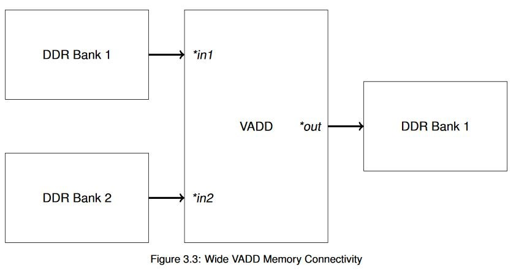
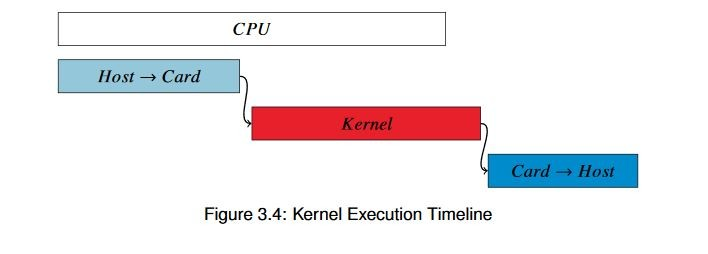

<table class="sphinxhide" width="100%">
 <tr width="100%">
    <td align="center"><h1>Vitis™Hardware Acceleration Introduction Tutorial</h1>
    <a href="https://www.xilinx.com/products/design-tools/vitis.html">See Vitis™ Development Environment on xilinx.com</a>
    </td>
 </tr>
</table>

## Overview

We have made some big gains in our overall system throughput, but the bottleneck is now very clearly the accelerator itself. Remember, that there are two axes on which we can optimize a design: we can throw more
resources at a problem to solve it faster, which is bound by **Amdahl's Law**, or we can do more fundamental operations in parallel following **Gustafson's Law**.

In this case, we will try optimizing along the axis of Amdahl's Law. Up until now our accelerator has been following basically the same algorithm as the CPU, performing one 32-bit addition on each clock tick. But, because the CPU has a significantly faster clock (and has the advantage of not having to transfer the data over PCIe®) it is always been able to beat us. Now it is time to turn the tables.

Our DDR controller natively has a 512-bit wide interface internally. If we parallelize the data flow in the accelerator, that means we will be able to process 16 array elements per clock tick instead of one. So, we should be able to get an instant 16x speed-up by just vectorizing the input.

## Key Code

In this example, if we continue to focus on the host software and treat the kernel as a black box, we wind up with code that is essentially identical to the code from Example 3. All we need to do is change the kernel name from `vadd` to `wide_vadd`.

Since the code is the same, this is a good opportunity to introduce another concept of working with memory in Xilinx Runtime (XRT) and OpenCL™. On the AMD Alveo™ Data Center accelerator cards we have four memory banks available, and while it is not necessary with these simple accelerators, you might find that you wish to spread operations among them to help maximize the bandwidth available to each of the interfaces.  For our simple vector addition example, just for illustration purposes, we have used the topology shown here:



What we gain by doing this is the ability to perform high-bandwidth transactions simultaneously with different external memory banks. Remember, long bursts are generally better for performance than many small reads and writes, but you cannot fundamentally perform two operations on the memory at the same time.

It is easy enough to specify the hardware connectivity via command line switches, but when we want to actually transfer buffers down to the hardware, we need to specify which memories to use for XRT.  AMD accomplishes this by way of an extension to the standard OpenCL library, using a struct `cl_mem_ext_ptr_t` in combination with the buffer allocation flag `CL_MEM_EXT_PTR_XILINX`. In the code, that looks like this:

```cpp
// Declare physical memory bank connectivity
cl_mem_ext_ptr_t bank1_ext, bank2_ext;
bank2_ext.flags = 2 | XCL_MEM_TOPOLOGY;
bank2_ext.obj   = NULL;
bank2_ext.param = 0;
bank1_ext.flags = 1 | XCL_MEM_TOPOLOGY;
bank1_ext.obj   = NULL;
bank1_ext.param = 0;

// Allocate buffers
cl::Buffer a_buf(context,
                 static_cast<cl_mem_flags>(CL_MEM_READ_ONLY |
                                           CL_MEM_EXT_PTR_XILINX),
                 BUFSIZE*sizeof(uint32_t),
                 &bank1_ext,
                 NULL);
cl::Bufferb_buf(context,
                 static_cast<cl_mem_flags>(CL_MEM_READ_ONLY |
                                           CL_MEM_EXT_PTR_XILINX),
                 BUFSIZE*sizeof(uint32_t),
                 &bank2_ext,
                 NULL);
cl::Buffer c_buf(context,
                 static_cast<cl_mem_flags>(CL_MEM_READ_WRITE |
                                           CL_MEM_EXT_PTR_XILINX),
                 BUFSIZE*sizeof(uint32_t),
                 &bank1_ext,
                 NULL);
```

You can see that this code is very similar to the previous example, with the difference being that we are passing our `cl_mem_ext_ptr_t` object to the `cl::Buffer` constructor and are using the flags field to specify the memory bank we need to use for that particular buffer.  Note again that there is fundamentally no reason for us to do this for such a simple example, but since this example is so structurally similar to the previous one, it seemed like a good time to mix it in. This can be a very useful technique for performance optimization for very heavy workloads.

Otherwise, aside from switching to the `wide_vadd` kernel, the code here is exactly unchanged other than increasing the buffer size to 1 GiB. This was done to better accentuate the differences between the hardware and software.

## Running the Application

With the XRT initialized, run the application by running the following command from the build directory:

`./04_wide_vadd alveo_examples`

The program will output a message similar to this:

```
-- Example 4: Parallelizing the Data Path --

Loading XCLBin to program the Alveo board:

Found Platform
Platform Name: Xilinx
XCLBIN File Name: alveo_examples
INFO: Importing ./alveo_examples.xclbin
Loading: './alveo_examples.xclbin'
Running kernel test XRT-allocated buffers and wide data path:

OCL-mapped contiguous buffer example complete!

--------------- Key execution times ---------------
OpenCL Initialization:              244.463 ms
Allocate contiguous OpenCL buffers: 37.903 ms
Map buffers to userspace pointers:  0.333 ms
Populating buffer inputs:           30.033 ms
Software VADD run :                 21.489 ms
Memory object migration enqueue :   4.639 ms
Set kernel arguments:               0.012 ms
OCL Enqueue task:                   0.090 ms
Wait for kernel to complete :       9.003 ms
Read back computation results :     2.197 ms
```

| Operation                             |  Example 3   |  Example 4   | &Delta;3&rarr;4 |
| ------------------------------------- | :----------: | :----------: | :-------------: |
| OCL Initialization                    |  247.460 ms  | 244.463  ms  |        -        |
| Buffer Allocation                     |  30.365 ms   |  37.903 ms   |    7.538 ms     |
| Buffer Population                     |  22.527 ms   |  30.033 ms   |    7.506 ms     |
| Software VADD                         |  24.852 ms   |  21.489 ms   |    -3.363 ms    |
| Buffer Mapping                        | 222 &micro;s | 333 &micro;s |        -        |
| Write Buffers Out                     |  66.739 ms   |   4.639 ms   |        -        |
| Set Kernel Args                       | 14 &micro;s  | 12 &micro;s  |        -        |
| Kernel Runtime                        |  92.068 ms   |   9.003 ms   |   -83.065 ms    |
| Read Buffer In                        |   2.243 ms   |   2.197 ms   |        -        |
| &Delta;Alveo&rarr;CPU                 | -323.996 ms  | -247.892 ms  |   -76.104 ms    |
| &Delta;FPGA&rarr;CPU (algorithm only) |  -76.536 ms  |   5.548 ms   |   -82.084 ms    |

Mission accomplished — we have managed to beat the CPU!

There are a couple of interesting bits here, though. The first thing to notice is that, as you probably expected, the time required to transfer that data into and out of the FPGA has not changed. Like we discussed in earlier sections, that is effectively a fixed time based on your memory topology, amount of data, and overall system memory bandwidth utilization. You will see some minor run-to-run variability here, especially in a virtualized environment like a cloud data center, but for the most part you can treat it like a fixed-time operation.

The more interesting one, though, is the achieved speedup. You might be surprised to see that widening the data path to 16 words per clock did not, in fact, result in a 16x speedup. The kernel itself processes 16
words per clock, but what we are seeing in the timed results is a cumulative effect of the external DDR latency. Each interface will burst in data, process it, and burst it out. But the inherent latency of going back and forth to DDR slows things down, and we only actually achieve a 10x speedup over the single-word implementation.

Unfortunately, we are hitting a fundamental problem with vector addition: it is too easy.  The computational complexity of `vadd` is O(N), and a very simpleO(N) at that. As a result, you very quickly become I/O bandwidth bound, not computation bound. With more complex algorithms, such as nested loops which are O(Nx) or even computationally complex O(N) algorithms like filters needing lots of calculations, we can achieve significantly higher acceleration by performing more computation inside the FPGA fabric instead of going out to the memory quite so often.  The best candidate algorithms for acceleration have very little data transfer and lots of calculations.

We can also run another experiment with a larger buffer. Change the buffer size:

```cpp
#define BUFSIZE (1024*1024*256)// 256*sizeof(uint32_t) = 1 GiB
```

Rebuild and run it again, and now switch over to a simplified set of metrics as in the following table. I think you get the idea on OpenCL initialization by now, too, so we will only compare the algorithm's performance. That does not  mean that this initialization time is not important, but you should architect your application, so it is a one-time cost that you pay during other initialization operations.

We will also stop tracking the buffer allocation and initialization times.  Again this is something that you would generally want to do when setting up your application. If you are routinely allocating large buffers in the critical path of your application, odds are you would get more "bang for your buck" rethinking your architecture rather than trying to apply hardware acceleration.

| Operation             |  Example 4  |
| --------------------- | :---------: |
| Software VADD         | 820.596 ms  |
| Buffer PCIe TX        | 383.907 ms  |
| VADD Kernel           | 484.050 ms  |
| Buffer PCIe RX        | 316.825 ms  |
| Hardware VADD (Total) | 1184.897 ms |
| &Delta;Alveo&rarr;CPU | 364.186 ms  |

Oh no! We had such a good thing going, and here we went and ruined it. With this larger buffer, we are not beating the CPU anymore at all. What happened?

Looking closely at the numbers, we can see that while the hardware kernel itself is processing the data pretty efficiently, the data transfer to and from the FPGA is really eating up a lot of our time. In fact, if you were to draw out our overall execution timeline, it would look something like Figure 3.4 at this point.



This chart is figurative but to relative scale.  Looking closely at the numbers, we see that in order to beat the CPU, our entire kernel would need to run to completion in only about 120 ms. For that to work, we would need to run four times faster (not likely), process four times as much data per clock, or run four accelerators in parallel. Which one should we pick? Leave that for the next example.

## Extra Exercises

Some things to try to build on this experiment:

- Play around with the buffer sizes again. Can you find the inflection point where the CPU becomes faster?
- Try to capture the Vitis Timeline Trace and view this for yourself. The instructions for doing so are found in the [Vitis Documentation](https://docs.amd.com/v/u/en-US/ug1416-vitis-documentation).

## Key Takeaways

- Parallelizing the kernel can provide great results, but you need to take care that your data transfer does not start to dominate your execution time. Or if it does, that you stay under your target execution time.

- Simple computation is not always a good candidate for acceleration, unless you're trying to free up the processor to work on other tasks. Better candidates for acceleration are complex workloads with high complexity, especially O(Nx) algorithms like nested loops, etc.
- If you have to wait for all of the data to transfer before you begin processing, you might have trouble hitting your overall performance target even if your kernels are highly optimized.

Now we have seen that just parallelizing the data path is not quite enough. See what we can do about those transfer times.

Read [**Example 5:** Optimizing Compute and Transfer](./05-optimizing-compute-and-transfer.md)

<p class="sphinxhide" align="center"><sub>Copyright © 2020–2023 Advanced Micro Devices, Inc</sub></p>

<p class="sphinxhide" align="center"><sup><a href="https://www.amd.com/en/corporate/copyright">Terms and Conditions</a></sup></p>
