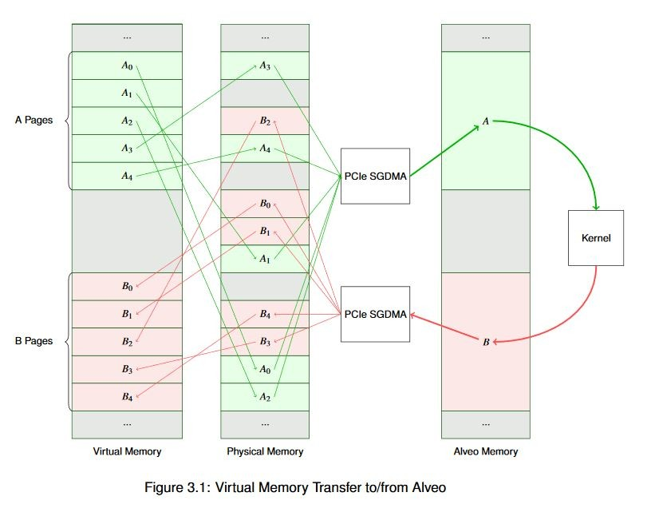
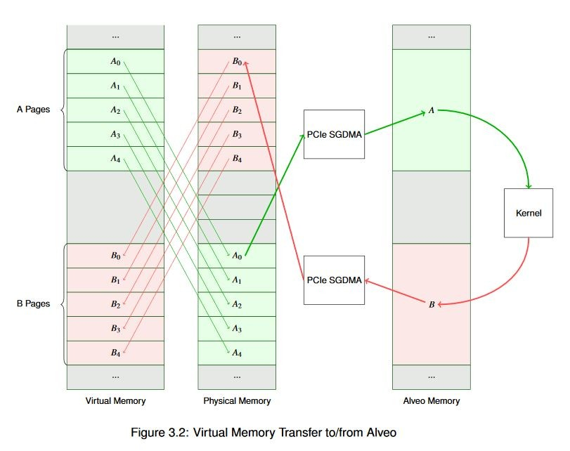

<table class="sphinxhide" width="100%">
 <tr width="100%">
    <td align="center"><h1>2022.2 Vitis™ - Runtime and System Optimization - Runtime SW Design</h1>
    <a href="https://www.xilinx.com/products/design-tools/vitis.html">See Vitis™ Development Environment on xilinx.com</a>
    </td>
 </tr>
</table>

## Memory Allocation Concepts

When you run a program on a CPU, you do not generally worry about how the underlying hardware manages memory. There are occasional issues with alignment, etc. on some processor architectures, but largely modern OSes and compilers abstract these things to a degree where they are not usually visible unless you deal with a lot of low-level driver work (or acceleration).

Fundamentally, we can think of memory as broadly having a set of six attributes. Given a pointer to a data buffer, that data pointer may be **virtual** or **physical**. The memory to which it points may be **paged**
or **physically contiguous**. And, finally, from the standpoint of the processor that memory can be **cacheable** or **non-cacheable**.

Most modern operating systems make use of virtual memory. There are many reasons for doing so, but to keep this document from veering off course and morphing into a computer architecture textbook, just know that Linux, which is likely running your Xilnx Runtime (XRT), uses virtual memory. As a result, when you use a standard C or C++ userspace API function such as `malloc()` or `new`, you wind up with a pointer to a virtual memory address, not a physical one.

You will also likely wind up with a pointer to a block of addresses in memory that is **paged**. Nearly every modern OS (again including Linux) divides the address range into pages, typically with each page having a size of 4 KiB (although this can vary system to system). Each page is then mapped to a corresponding page in the physical memory. And before someone points out that this is an inaccurately simplified generalization, I would like to respectfully remind you that this is not a computer architecture course!

There are two important things to note, though. The first is that when you allocate a buffer from the heap with standard C APIs, you are not getting a physical memory address back. And second, you are not getting a single buffer — you are getting a collection of N memory pages, each 4 KiB long. To put that in context, say we allocate a buffer of 6 MiB. That would give us:

```
(1024 B * 1024 B * 6) / (1024 B * 4) = 1,536 Pages
```

If you wanted to copy that entire 6 MiB buffer from the host to your AMD Alveo™ Data Center accelerator card, you would need to resolve 1536 virtual page addresses to physical memory address.  You would then need to assemble these physical addresses into a scatter gather list to enqueue to a DMA engine with scatter-gather capability, which would then copy those pages one-by-one to their destination.  It also works in reverse if you were to copy a buffer from the Alveo card to a virtual, paged address range in host memory.  Host processors are generally quite fast, and as a result building this list does not take a huge amount of time.  But given decently large buffers, this can contribute to the overall system latency, so it is important to understand the implications this can have on your overall system performance.

For a simplified graphical view of such a system, refer to the following figure. In this example, we have two buffers, creatively named A and B. Both A and B are virtual buffers. In our example, we want to transfer A to Alveo, do something to it that results in an update to buffer B, and transfer it back.  You can see how the virtual to physical mapping works. Within the Alveo card, accelerators operate only on physical memory addresses and data is always stored contiguously; this is primarily because this configuration generally provides the best performance.



As you can see, our simplified example data flow is already somewhat complex! Now, imagine that across a significantly large buffer: one spanning many megabytes (or gigabytes) with thousands and thousands of pages. You can see how building and managing those scatter gather lists and managing the page tables can become time consuming even for a fast host processor. In reality, memory is not usually quite so fragmented as our example. But because you do not usually know the physical addresses of the pages ahead of time, you must treat them as though each one is unique.

It is much easier to build a scatter gather list, though, if you know that all of the pages are contiguous in physical memory. That is, the data bytes are laid out sequentially, where incrementing the physical address gives you data[n+1]. In that case, you can build a scatter gather list knowing only the start address of the buffer and its size.

This is a benefit for many DMA operations, not just DMA to and from  the Alveo card.  Modern operating systems provide memory allocators (typically through kernel services) for just this purpose. In Linux, this is done through the Contiguous Memory Allocator subsystem. This is kernel-space functionality but is exposed to users through a variety of mechanisms including dmabuf, the XRT API, various graphics drivers, and other things. If we allocate the previous buffer contiguously, we wind up with a much simpler view of the world, as shown in the following figure.



You might be wondering what happens if your buffer does not begin on an aligned 4k page boundary. Good question! DMA engines generally require some degree of alignment, and the Alveo DMA is no different. If your allocated memory is not aligned to a page boundary, the runtime will align it for you.  Although you will incur a `memcpy()` operation, which is expensive computationally. You will also see a warning from the runtime (assuming you have not suppressed them) because this is a problem you will want to resolve as quickly as possible. Identifying and fixing this issue is addressed later on.

Finally, we must understand whether our memory is **cacheable** or **non-cacheable**. Because external memory access is expensive, nearly all modern processors maintain an internal cache of data with very low latency. Depending on the processor architecture, the size of the cache may vary from tens of kilobytes to many megabytes. This internal cache memory is synchronized with the external physical memory as needed. Generally this cache management is invisible to the software running on the processor - you would see the benefit of using a cache in your improved execution times, but you don't have to interact with it from a general development perspective.

However, when using DMA it iss important to recognize absent cache coherency sharing technologies such as cache coherent interconnect for accelerators (CCIX), you must ensure that any data the processor wants to share with the accelerator is synchronized with the external memory before it is transferred. Before starting a DMA transfer you need to ensure that data resident in the cache is **flushed** to external memory.  Similarly, once data is transferred back you must ensure that data resident in the cache is **invalidated** so it will be refreshed from the external memory. These operations are very fast for x86-style processors, and are transparently handled by the runtime, but other architectures  may have performance penalties for cache management.  To mitigate this, the API has functionality for allocating and working with non-cacheable buffers.  Do keep in mind, though, that a processor accessing data in a non-cacheable buffer will generally be much slower than just running cache management operations in the first place.  This is usually used for models where the processor is sequencing buffers but not actually accessing the data they contain.

## Alveo Guided Software Introduction

Whew, that is a lot of background! Recap the important points before we jump into the guided software example:

- Acceleration is generally done on some intersection of two axes: trying to do the same task **faster**
  (Amdahl's Law), or trying to do more tasks in the **same time** (Gustafson's Law). Each axis has different implications on how to optimize, and how impactful that optimization will be.
- Acceleration inherently comes with an **acceleration tax**. To achieve acceleration in a real system, the benefits achieved by acceleration must dominate the extra latency of the data transfers. You should pick your battles; focus on the **biggest bang for the buck** pieces of your algorithms.
- Interaction with the Alveo cards is done through XRT and higher-level API abstractions like OpenCL or the
  XRT Native API. Software-side optimization is done via the library, independent of the optimization of the
 hardware kernels.
- Memory allocation and management can have a significant effect on your overall application performance.

We will explore all of these topics in detail in the examples.

Read [**Next Section**: Guided Software Examples](./guided_sw_examples.md)

<p class="sphinxhide" align="center"><sub>Copyright © 2020–2023 Advanced Micro Devices, Inc</sub></p>

<p class="sphinxhide" align="center"><sup><a href="https://www.amd.com/en/corporate/copyright">Terms and Conditions</a></sup></p>
